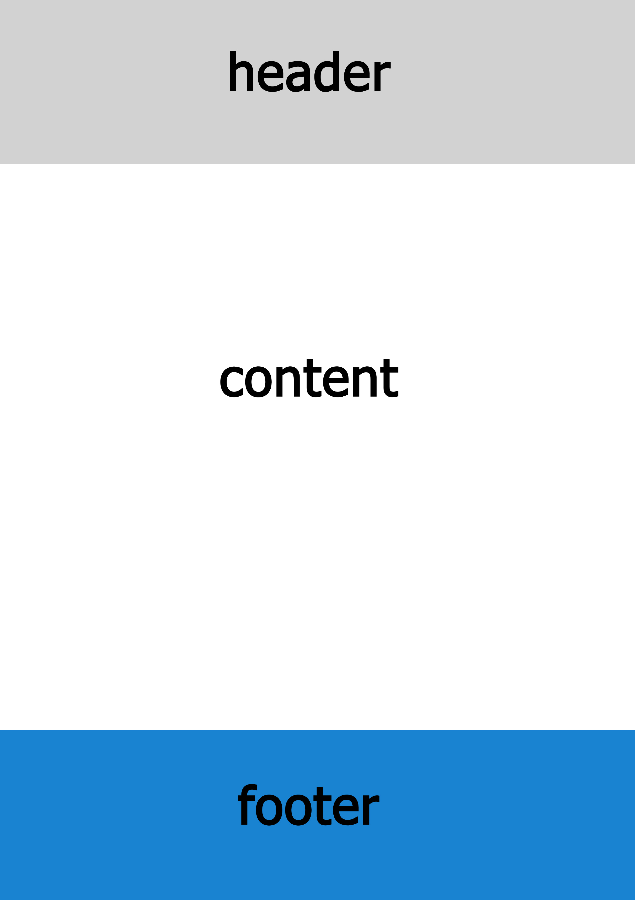
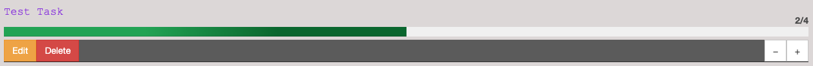

# Test task for Trainee Frot-End developer

## Introduction
The purpose of this exercise is for the developer to exhibit his familiarity with frontend technologies, programming patterns and to provide with a sample of what clean and reusable code means to the candidate.

## UI/UX
Try creating something simple, user friendly and eye appealing. Feel free to use any UI resources you’d like to achieve that. For example you could use `Bootstrap`, `Material` , or any other UI library.

## Architecture
Here there is no limitation. Design your application anyway you want. Focus on clean, reusable code. Focus on frontend best practices. Show us that you know how to produce high quality modern web applications.

## Backend
No Backend required. To store achivements just use `localStorage`.

## Exercise

Create application with 3 sections

- `header` should have application name in all pages
- `content` should have content specific for each page.
- `footer` should have application navigation. Make footer stick to bottom of page. 

### Footer

Application navigation should be implemented similar to iOS bottom navigation. 
Example: 

Should have 4 menu items (`Tasks`, `Completed`, `Statistics`, `Profile`).

### Tasks

This page should have list of available tasks and ability to add new.

Each task should have `name`, `progress`. In default state only this fields should be visible on view.

Clicking on each task should show `+` and `-` buttons that is changing progress in this task. Also `edit` and `delete` buttons with ability to edit and delete in accordance.

If task progress is 100% remove task from this page and it should apear on `Completed` page.

<i>Example:</i>

### Completed

This page should have list of completed tasks (100% progress). Clicking on task user should see option to start this task again. Task should disapear from this page and be available in `Tasks` page.

### Statistics

Render `Bar chart` with any data on this page. Data value should be from 0-100. When data value is 1-50 bar should have `green` color. In case when data value is 51-100 bar should have `red` color.

### Profile

Implement page with your own CV. Provide short information about you, your education, experiance. Implement in any design and structure.
